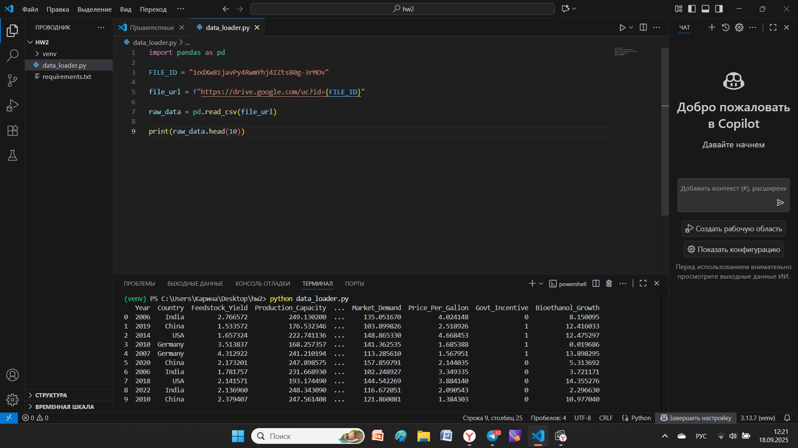

# my-project
#Домашняя работа 1
Ссылка на датасет Bio Ethanol Production Dataset: https://drive.google.com/file/d/1odXw81javPy4RwmYhj4IZts80g-3rMOv/view?usp=sharing

#Домашняя работа 2
Скрипт `data_loader.py` читает датасет и выводит первые 10 строк.
Результат работы скрипта:

